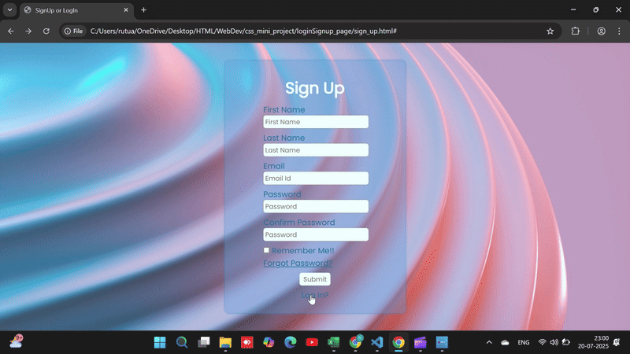

# 🔐 Login / Sign Up Toggle UI (HTML & CSS Only)

This is a responsive and visually appealing **Login & Sign-Up form toggle** built using only HTML and CSS. The form switching animation is handled entirely using CSS transitions and a hidden checkbox — no JavaScript is involved!

---
## 🔍 Preview

---

## ✨ Features

- ✅ Toggle between **Sign Up** and **Log In** forms
- 🎨 Clean and modern UI using Poppins and Montserrat fonts
- 📱 Fully responsive design (mobile-friendly)
- 🌈 Smooth transition animations
- 🧼 Organized, maintainable HTML and CSS
- ❌ No JavaScript used — logic handled purely via CSS

---

## 💻 Technologies Used

- HTML5
- CSS3
- Google Fonts

---

